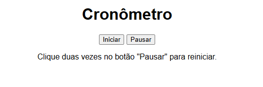

# Cronômetro

<p><br>
Demonstração da tela

Este é um cronômetro simples desenvolvido com HTML e JavaScript. O projeto permite iniciar e pausar o tempo, com uma interface intuitiva.

## Funcionalidades

- Iniciar o cronômetro
- Pausar o cronômetro
- Reiniciar o cronômetro (clicando duas vezes no botão "Pausar")
- Exibição do tempo decorrido

## Tecnologias Utilizadas

- HTML
- JavaScript

## Como Usar

1. **Clone o repositório**:
   ```bash
   git clone https://github.com/seu_usuario/cronometro.git
   ```

2. **Abra o arquivo `index.html` em um navegador**.

3. **Use os botões para controlar o cronômetro**:
   - **Iniciar**: Começa a contagem do tempo.
   - **Pausar**: Interrompe a contagem do tempo. Clique duas vezes para reiniciar.